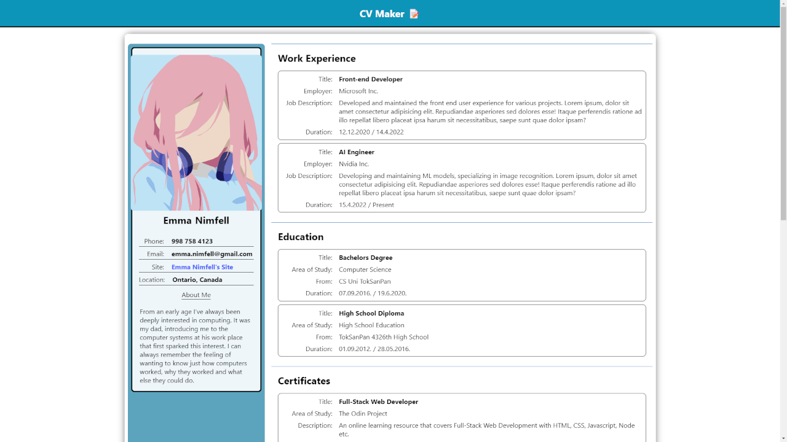
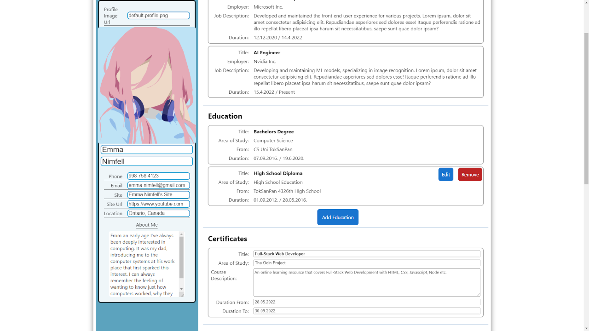

# CV Project

Site Link: https://nenopr.github.io/cv-project-TheOdinProject/

# CV Maker Project

## 📌 Overview

A web app that allows you to create your CV. This project was made as a learning experience for React.

## 🛠️ Tech stack

- Frontend: React

## 🚀 Features
- Add/remove/edit fields to create your CV.
- Export it as a .pdf file

## 📸 Screenshots

	
	

## 🔗 Live Site

[Game Demo](https://nenopr.github.io/cv-project-TheOdinProject/)
